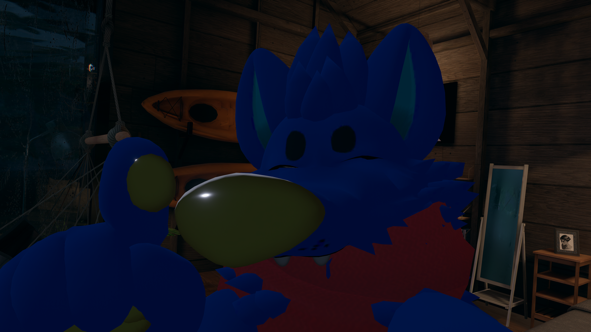

# physbone SDKの個人的導入ドキュメント

## 本ページを元に操作し、そのせいでunityがこわれた場合、責任は負いませんが、ぜひ[@kaku_vrc](https://twitter.com/kaku_vrc)か[kaku/かく(vrchat)](https://vrchat.com/home/user/usr_509b0b5d-cd03-4463-9320-b6e87e66d4ac)にご連絡ください。   
## 指さしながらトロールします

## おさらいQ＆A
自動変換おさらい：DBアバターをクライアント自動変換とSDK内変換ツール両方あります

Q1：Dynamicboneと旧SDKは使えなくなるのか？  
A1：４月現時点では両方使えます、アップロードもできます。ただし、DBのコンポーネントはデフォルトでVRChatクライアント上でPBに変換されます。  
  
Q2:自動変換あればいじらなくてもいいじゃん？  
A2：publicアバターはしょうがないですが、変換の精度も保障できないし、今後いつかクライアント上DB使えなくなる可能性もありますので、自分でprivate上げれる人は作業しましょうしょう。

Q3：めんどくさい  
A3：やれ 誰もベータやらないから泣いた 今やる分損はしないぞ

Q4：DynamicBoneパッケージはもう導入しなくてもいい？  
A4：DB向けにセットしたアバターアセットの場合、両boneの比較に使うので導入するのお勧めします。実際導入しない、missing scriptが発生している場合で変換できるかは個人で検証してない。

## SDK置き換え

最初にバックアップ撮りましょうねとると  

  
unity本体を閉じて、プロジェクトフォルダーをコピーかZIPするだけ！unity hubでパス確認できるぞ！  

バックアップ撮ったら、次にいつも通りvrchatのダウンロードページからAVATAR SDK落として入れましょう  
＊プロジェクト内の旧SDKは削除せずにしてください。  

（このドキュメント時にあるものはVRCSDK3-AVATAR-2022.04.21.03.29_Public.unitypackageになります）  
＊置き換えは一部変更されているファイルだけですので、脳死インポートで大体置き換えられると思います

# やったねたえちゃん これで改変しないといけないね！

## SDK内変換ツール

!!!!!!!!!!!!!!!!!!!!!!!!!!!!!!!!!!!!!!!!!!!!!!!!!!!!!!!!!!!!!!!!!!!!!!!!!!!!!!!!!!!!!!!!!!!!!!!!!!!!!!!!  
同じアバター内にDBとPBコンポーネント両方存在することはお勧めしません、DBコンポーネント無効化の状態であっても、自動変換で有効化されます。（古いベータでのテスト）  
ですのでDB PBのアバターを分離して編集することをお勧めします。
!!!!!!!!!!!!!!!!!!!!!!!!!!!!!!!!!!!!!!!!!!!!!!!!!!!!!!!!!!!!!!!!!!!!!!!!!!!!!!!!!!!!!!!!!!!!!!!!!!!!!!!!

新SDKではDynamicBoneが入ってるアバターは移行の警告が追加されています。  

オリジナルprefab（比較・引き戻し用）の変更を回避するため、続きに個人的な変換作業を書き残します。

（右メニュー操作イメージ）

一回ヒエラルキーのアバターを右クリックして「duplicate」を選択します（もしくはctrl+D）で複製し、複製されたものをまた右クリックして「unpack prefab completely」にクリック。  
これでアイコンが灰色になったオブジェクト（アバター）を編集しても、project内にあるオリジナルprefabには変更が反映されません。  
  
次にprefab解除されたに選択した状態で上部メニューVRChat SDK > Utilites > Convert DnyamicBone to PhysBones を選択します。  
警告が出るので、OKをクリックすれば、全体のDBはPBに置き換われます。

個人的に使用していた、Quest対応の[VRCQuestTools](https://booth.pm/ja/items/2436054)をPBに変換したアバターは、クエスト変換掛けてもPBのコンポーネントはDBみたいに削除されず、そのままquest向けにアップロードできます。（ただしPBコンポーネントのアバターランクに要注意）  
ref:[quest PB 制限](https://twitter.com/rapt_vrc/status/1516998812401037312?s=21&t=Udqwy0K_p3xsod2VdPEaMA)

## ここで注意
クライアント自動変換 もしくは SDK変換でかけたboneは、必ずしも触れる・掴める設定にされていると限りません、以下のセクションで掴み判定を説明する  
## PhysBoneコンポーネント
掴み・伸ばしとavatarパラメータの設定だけ説明します  

掴める条件は、ColLison > Radius の数値は０より大きいな場合しか掴めません  
Grab & Pose の部分はオブジェクトが掴めるか・固定できるか動かを設定します、 Max Strechを数値を設定することで、ボーンを通常より掴んで伸ばせることができます。    

これで伸ばせる やったね
  
Optionsのparameterを一意の名称を追加すること、掴んでるか{hoge}_IsGrabbed（bool) ・ 角度{hoge}_Angle (Float) ・ 伸ばし程度 {hoge}_Strech (Float) の三つのパラメータを使用することができます。  
アバターのexpressions parametersに追加せずともグローバル同期されます。これでアニメーターで条件組めるね！やった～～

Is Animatedは、アニメーションで動きをつけてるボーンに対して有効化しないと、アニメーションによる制御が不可になります。言い換えれば、アニメーションで制御されてないものは、解除した方が軽いとも言えます。

## contact機能
いわゆるあたり判定 、reciever と sender 両方コンポーネントが追加されています。

デフォルトでは非対応のアバターでも自動的に一部判定が生成されます。
頭・胴体・両手（指含む）・両足（デフォルト生成なので手動的の調整はAvatar Descriptorから無効化・調整できます）    
ref:[vrchat Contacts](https://docs.vrchat.com/docs/contacts)  
送信側・受信側どちらも特定タグがつけられているだけものに反応されます
。
レシーバーに反応したものはexpressions parametersに追加せずともグローバル同期されます。int float bool全部使えるよ（公式ドキュメントみてね）。  
パラメータ変更条件もConstant（判定時にずっと設定値）OnEnter （侵入時だけ設定値） Proximity （中心からの距離によって変動）。  
つまりお互いに秘密な判定タグを作れば、特定の人だけに発動することもできる、同一タグを設定した人にハイタッチすることでアニメーション再生してエフェクト出すこともできる。 やった～～～  

