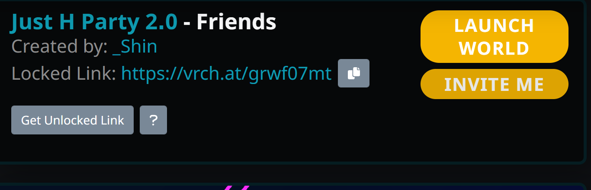
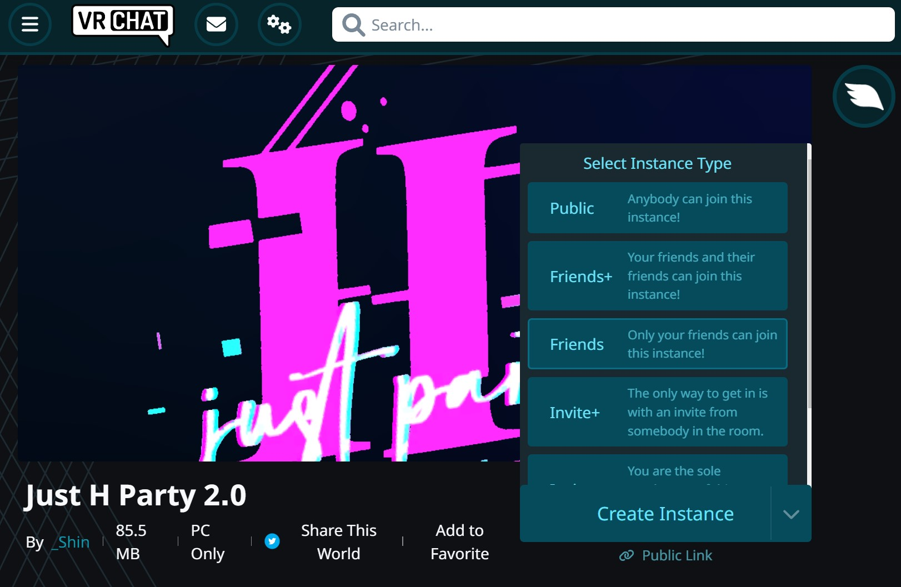
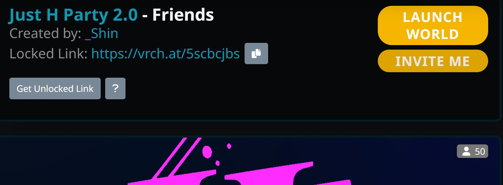
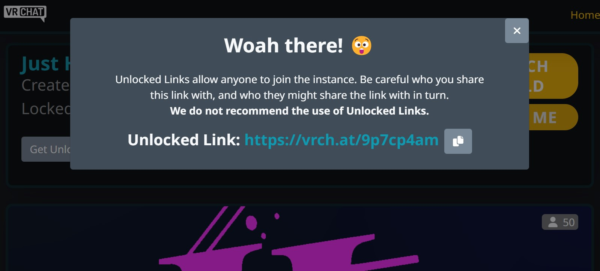

# リンクからインスタンスの入り方

一回インスタンス生成すれば、全員出た後でも、ワールド情報さえあればインスタンスを維持できる（インスタンス主・インスタンスタイプの維持）  

## フレンド・フレンドプラのインスタンスタイプ別
Lockedインスタンス：リンクからインスタンス主であればフレンドでなければ入れない  
Unlockedインスタンス：リンクをしていれば誰でも入れるインスタンス

Invite+以下とPublicのインスタンスはUnlockedだけ

## インスタンスinvite

[JUST?](https://vrchat.com/home/launch?worldId=wrld_e5c30b56-efa8-42d5-a8d4-a2cca2bf3403&instanceId=97353~friends(usr_509b0b5d-cd03-4463-9320-b6e87e66d4ac)~region(jp)~nonce(6675faa6-33fa-4ec3-9c27-aa0b84566605)&shortName=45dkcqhf)

   
赤ステータス以外、VRChat本体を起動した状態で、リンクのINVITE MEをクリックすれば該当インスタンスに入れる。  

# インスタンスリンクのつくり方

## Web上から

ワールドを選んで、Create Instanceをクリック  

初期ではインスタンス主のフレンドしか入れないLocked状態になります、Link横のボタンでインスタンスURLで生成できます

フレンドでなくともリンクをしている人であればだれでも入れる状態にしたいなら、Get Unlocked Linkをクリックすれば生成されます。